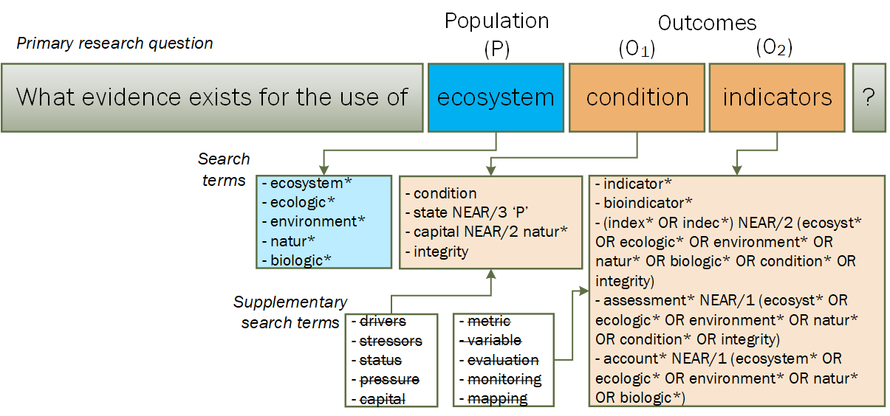

```{r setup, include=FALSE}
knitr::opts_chunk$set(echo = TRUE)
```

# Scoping study summary

Meeting time: 24.03.2022

Present

- Frode Singsaas
- Matt Grainger
- Anders Kolstad

## Research question

We started by formulating a primary research question. We decided on a PO type question (ref), with two levels of outcome (O1 and O2).
Then we worked to identify related terms and to constrict the search so that we get an acceptable level of precision. 


```{r question, echo=F, out.width="100%", fig.cap="The primary research question for the Re-scalable Indicator Review and how the consepts link to the search terms."}

```


##  litserachr
Matt searched web of science (WoS) using `ecosystem condition assessment indicator` and downloaded the first 1000 hits as a RIS file which he then imported into [`litseachr`](https://elizagrames.shinyapps.io/litsearchr/).

The app gives a list of words or phrases that typically occur together within the title, abstract and author defined key words.

It then condense this list to identify key words that you could use in order to obtain 25, 50, or 80% of the papers.

The most condensed list (25%) contained around 170 phrases. 

Based on this we updated Figure 1 with some additional search terms. 

Single terms were restricted when needed, using the NEAR statement. Peripheral terms are excluded from the [initial search string](data/initial search terms.docs), but kept for later sensitivity analyses (crossed though word in FIgure 1). 


## Initial search
The initial search string yielded 49 577 hits (WoS; 24.03.2022):

`(ecosystem* OR ecologic* OR environment* OR natur* OR biologic*) AND (condition OR state NEAR/3 (ecosystem* OR ecologic* OR environment* OR natur* OR biologic*) OR capital NEAR/2 (natur*) OR integrity) AND (indicator* OR bioindicator* OR ((index* OR indec*) NEAR/2 (ecosyst* OR ecologic* OR environment* OR natur* OR biologic* OR condition* OR integrity)) OR assessment* NEAR/1 (ecosyst* OR ecologic* OR environment* OR natur* OR condition* OR integrity) OR account* NEAR/1 (ecosystem* OR ecologic* OR environment* OR natur* OR biologic*))` 

We then excluded all but the following article types:
- Articles or Reviews
- Early access
- Proceedings Papers
- Book chapters


`[...] AND (DT==("ARTICLE" OR "REVIEW" OR "EARLY ACCESS" OR "PROCEEDINGS PAPER" OR "BOOK CHAPTER")`

This reduced the number of hits to 49 348 hits

We then removed references that were tagged with WoS categories belonging to clearly non-relevant resaerch fields: 
https://www.webofscience.com/wos/woscc/summary/b3531dbb-90e4-4816-b8b5-58b79372e762-2c35adc2/relevance/1

`[...]... NOT TASCA==("PUBLIC ENVIRONMENTAL OCCUPATIONAL HEALTH" OR "GREEN SUSTAINABLE SCIENCE TECHNOLOGY" OR "ENGINEERING CIVIL" OR "COMPUTER SCIENCE INFORMATION SYSTEMS" OR "ENDOCRINOLOGY METABOLISM" OR "MINERALOGY" OR "PSYCHOLOGY CLINICAL" OR "EDUCATION EDUCATIONAL RESEARCH" OR "HEALTH CARE SCIENCES SERVICES" OR "NUTRITION DIETETICS" OR "ASTRONOMY ASTROPHYSICS" OR "MEDICINE RESEARCH EXPERIMENTAL" OR "NUCLEAR SCIENCE TECHNOLOGY" OR "CLINICAL NEUROLOGY" OR "TELECOMMUNICATIONS" OR "IMMUNOLOGY" OR "NANOSCIENCE NANOTECHNOLOGY" OR "BUSINESS FINANCE" OR "SPORT SCIENCES" OR "METALLURGY METALLURGICAL ENGINEERING" OR "ONCOLOGY" OR "ELECTROCHEMISTRY" OR "SPECTROSCOPY" OR "ENGINEERING PETROLEUM" OR "OPTICS" OR "HEALTH POLICY SERVICES" OR "DEVELOPMENT STUDIES" OR "RADIOLOGY NUCLEAR MEDICINE MEDICAL IMAGING" OR "SOCIAL SCIENCES BIOMEDICAL" OR "DENTISTRY ORAL SURGERY MEDICINE" OR "TROPICAL MEDICINE" OR "ENGINEERING OCEAN" OR "ENGINEERING BIOMEDICAL" OR "PEDIATRICS" OR "NURSING" OR "PSYCHOLOGY EXPERIMENTAL" OR "REHABILITATION" OR "ENGINEERING MANUFACTURING" OR "PSYCHOLOGY APPLIED" OR "SURGERY" OR "ERGONOMICS" OR "PHYSICS MULTIDISCIPLINARY" OR "PSYCHOLOGY BIOLOGICAL" OR "REPRODUCTIVE BIOLOGY" OR "ENGINEERING AEROSPACE" OR "LAW" OR "MEDICAL INFORMATICS" OR "GERONTOLOGY" OR "MATHEMATICS APPLIED" OR "CHEMISTRY INORGANIC NUCLEAR" OR "PHYSICS ATOMIC MOLECULAR CHEMICAL" OR "CHEMISTRY MEDICINAL" OR "MATERIALS SCIENCE COMPOSITES" OR "MEDICINE LEGAL" OR "AREA STUDIES" OR "OBSTETRICS GYNECOLOGY" OR "PUBLIC ADMINISTRATION" OR "ARCHITECTURE" OR "PSYCHOLOGY DEVELOPMENTAL" OR "ORTHOPEDICS" OR "AUDIOLOGY SPEECH LANGUAGE PATHOLOGY" OR "COMPUTER SCIENCE THEORY METHODS" OR "MATERIALS SCIENCE BIOMATERIALS" OR "CHEMISTRY ORGANIC" OR "COMPUTER SCIENCE SOFTWARE ENGINEERING" OR "MATHEMATICS" OR "PATHOLOGY" OR "PHYSICS MATHEMATICAL" OR "RESPIRATORY SYSTEM" OR "GASTROENTEROLOGY HEPATOLOGY" OR "HEMATOLOGY" OR "PHYSICS CONDENSED MATTER" OR "DEMOGRAPHY" OR "DERMATOLOGY" OR "MEDICAL LABORATORY TECHNOLOGY" OR "CARDIAC CARDIOVASCULAR SYSTEMS" OR "OTORHINOLARYNGOLOGY" OR "HISTORY PHILOSOPHY OF SCIENCE" OR "DEVELOPMENTAL BIOLOGY" OR "PHYSICS FLUIDS PLASMAS" OR "SOCIAL WORK" OR "INFORMATION SCIENCE LIBRARY SCIENCE" OR "OPHTHALMOLOGY" OR "ALLERGY" OR "CRITICAL CARE MEDICINE" OR "PSYCHOLOGY EDUCATIONAL" OR "ACOUSTICS" OR "ENGINEERING MARINE" OR "INTERNATIONAL RELATIONS" OR "MATERIALS SCIENCE CHARACTERIZATION TESTING" OR "POLYMER SCIENCE" OR "SUBSTANCE ABUSE" OR "AUTOMATION CONTROL SYSTEMS" OR "HOSPITALITY LEISURE SPORT TOURISM" OR "MATHEMATICAL COMPUTATIONAL BIOLOGY" OR "POLITICAL SCIENCE" OR "GERIATRICS GERONTOLOGY" OR "INTEGRATIVE COMPLEMENTARY MEDICINE" OR "MATERIALS SCIENCE PAPER WOOD" OR "ART" OR "COMPUTER SCIENCE HARDWARE ARCHITECTURE" OR "MATERIALS SCIENCE TEXTILES" OR "UROLOGY NEPHROLOGY" OR "SOCIAL ISSUES" OR "PERIPHERAL VASCULAR DISEASE" OR "PSYCHOLOGY SOCIAL"))`

This reduced the number of hits to 39 099.

We coul not find a way to increase precision further without compromising. 

As a next step, Matt will do topic modelling to classify the references into research fields based on natural language processing. We might then be able to excluded more references.

## Scope

40 000 references is too much to go through and we need to find a way to cut this down further, even after the topic modelling has done its part. Here are some of the thoughts we have had around that.

1. We can stratify our review to only consider terrestrial ecoystems. Most of the references belong to either the freshwater or marine realms, so this would reduce the number of references considerably, and we might be able to process all the references. We call this the **biased but complete** approach. However, there is no good way to do this filtering in the search. For example, using the `NOT` statement is not recommended. But, we should be able to judge such an exclusion criteria quite rapidly in a title or abstract screening.

1. We can randomly select a managemen number of references from the complete list, as it stands now, covering all the realms. We call this the **Un-biased but incomplete** approach, because we would not be able to process all the references. 

1. We have not been able to include concepts such as `reference state/condition` or `rescaled` in our serach string. The largest part of the litterature will be presenting variables in their raw units, and not as re-scaled indicators, so by having these concepts in the search terms we would constrict the output considerably. However, these are concepts that are rarely mentioned in the title or abstract.

1. We cold also consider stratifying based in geographhy (e.g. Europe only). Same as for theo other options, this is not possible at the search stage, but can be implemented at the title and abstract screening stage.

**Conclusion and recomendation:**

We think that option 1 (**biased but complete**) is the best. Knowledg on indicators of ecological condition in terrestrial ecosystems are, presumably, lagging behing compared to freshwater and marine ecosystems, due to the longer history and tradition for ecosystem monitoring in these relams (e.g. WFD and MSFD). Another issue with option 2  is that our project team doesn't include any aquatic ecologists.


## Citation chasing

We will do forward and backwards citation chasing on a subset of the references which will be decided on later.


# Updated search late 2023


## Recap

The scoping study, which concluded with the original Wos search (see above), was done 2022-03-24. 
Title and abstract screening started in 2023-12-07. 
Now it is 2023-12-12 and time to update the original WoS search to get the latest records.


## Updated search string


We want to keep things as similar as possible. At the same time, we made some experiences in the first title and abstract screening about which serach terms worked and which that didn't. And we have a challenge with our search being to unspecific, so we wan to trim it down if we can, without loosing relevant records.

These terms did not seem to work:

-   environment\*
    -   mainly capturing cases where a variable was used as a model predictor
-   bioindicator\*
    -   mainly capturing *pollution* or *body condition* related records

Also natur\* and integrity were also not very good.

Here is how I test the effect of removing *environment\** and *bioindicator\**.

These are the three-times-two search strings (P-O-O) and the WoS categories filter. 
The words that we might want to take out of the 2023 search are in bold (see also Figure 2). 
<!-- Cross ref failed! -->

**Strings #1 and 4 ('P')**: (ecosystem\* OR ecologic\* OR **environment\*** OR natur\* OR biologic\*) (Topic)

**String #2 and 5 ('O1')**: (condition OR state NEAR/3 (ecosystem\* OR ecologic\* OR **environment\*** OR natur\* OR biologic*) OR capital NEAR/2 (natur*) OR integrity) (Topic)

**String #3 and 6 ('O2')**: TS=((indicator\* OR **bioindicator\*** OR ((index\* OR indec*) NEAR/2 (ecosyst* OR ecologic\* OR **environment\*** OR natur\* OR biologic\* OR condition\* OR integrity)) OR assessment\* NEAR/1 (ecosyst\* OR ecologic\* OR **environment\*** OR natur\* OR condition\* OR integrity) OR account\* NEAR/1 (ecosystem\* OR ecologic\* OR **environment\*** OR natur\* OR biologic\*)))

**String #7 (WoS categories)**: (DT==("ARTICLE" OR "REVIEW" OR "EARLY ACCESS" OR "PROCEEDINGS PAPER" OR "BOOK CHAPTER") NOT TASCA==("PUBLIC ENVIRONMENTAL OCCUPATIONAL HEALTH" OR "GREEN SUSTAINABLE SCIENCE TECHNOLOGY" OR "ENGINEERING CIVIL" OR "COMPUTER SCIENCE INFORMATION SYSTEMS" OR "ENDOCRINOLOGY METABOLISM" OR "MINERALOGY" OR "PSYCHOLOGY CLINICAL" OR "EDUCATION EDUCATIONAL RESEARCH" OR "HEALTH CARE SCIENCES SERVICES" OR "NUTRITION DIETETICS" OR "ASTRONOMY ASTROPHYSICS" OR "MEDICINE RESEARCH EXPERIMENTAL" OR "NUCLEAR SCIENCE TECHNOLOGY" OR "CLINICAL NEUROLOGY" OR "TELECOMMUNICATIONS" OR "IMMUNOLOGY" OR "NANOSCIENCE NANOTECHNOLOGY" OR "BUSINESS FINANCE" OR "SPORT SCIENCES" OR "METALLURGY METALLURGICAL ENGINEERING" OR "ONCOLOGY" OR "ELECTROCHEMISTRY" OR "SPECTROSCOPY" OR "ENGINEERING PETROLEUM" OR "OPTICS" OR "HEALTH POLICY SERVICES" OR "DEVELOPMENT STUDIES" OR "RADIOLOGY NUCLEAR MEDICINE MEDICAL IMAGING" OR "SOCIAL SCIENCES BIOMEDICAL" OR "DENTISTRY ORAL SURGERY MEDICINE" OR "TROPICAL MEDICINE" OR "ENGINEERING OCEAN" OR "ENGINEERING BIOMEDICAL" OR "PEDIATRICS" OR "NURSING" OR "PSYCHOLOGY EXPERIMENTAL" OR "REHABILITATION" OR "ENGINEERING MANUFACTURING" OR "PSYCHOLOGY APPLIED" OR "SURGERY" OR "ERGONOMICS" OR "PHYSICS MULTIDISCIPLINARY" OR "PSYCHOLOGY BIOLOGICAL" OR "REPRODUCTIVE BIOLOGY" OR "ENGINEERING AEROSPACE" OR "LAW" OR "MEDICAL INFORMATICS" OR "GERONTOLOGY" OR "MATHEMATICS APPLIED" OR "CHEMISTRY INORGANIC NUCLEAR" OR "PHYSICS ATOMIC MOLECULAR CHEMICAL" OR "CHEMISTRY MEDICINAL" OR "MATERIALS SCIENCE COMPOSITES" OR "MEDICINE LEGAL" OR "AREA STUDIES" OR "OBSTETRICS GYNECOLOGY" OR "PUBLIC ADMINISTRATION" OR "ARCHITECTURE" OR "PSYCHOLOGY DEVELOPMENTAL" OR "ORTHOPEDICS" OR "AUDIOLOGY SPEECH LANGUAGE PATHOLOGY" OR "COMPUTER SCIENCE THEORY METHODS" OR "MATERIALS SCIENCE BIOMATERIALS" OR "CHEMISTRY ORGANIC" OR "COMPUTER SCIENCE SOFTWARE ENGINEERING" OR "MATHEMATICS" OR "PATHOLOGY" OR "PHYSICS MATHEMATICAL" OR "RESPIRATORY SYSTEM" OR "GASTROENTEROLOGY HEPATOLOGY" OR "HEMATOLOGY" OR "PHYSICS CONDENSED MATTER" OR "DEMOGRAPHY" OR "DERMATOLOGY" OR "MEDICAL LABORATORY TECHNOLOGY" OR "CARDIAC CARDIOVASCULAR SYSTEMS" OR "OTORHINOLARYNGOLOGY" OR "HISTORY PHILOSOPHY OF SCIENCE" OR "DEVELOPMENTAL BIOLOGY" OR "PHYSICS FLUIDS PLASMAS" OR "SOCIAL WORK" OR "INFORMATION SCIENCE LIBRARY SCIENCE" OR "OPHTHALMOLOGY" OR "ALLERGY" OR "CRITICAL CARE MEDICINE" OR "PSYCHOLOGY EDUCATIONAL" OR "ACOUSTICS" OR "ENGINEERING MARINE" OR "INTERNATIONAL RELATIONS" OR "MATERIALS SCIENCE CHARACTERIZATION TESTING" OR "POLYMER SCIENCE" OR "SUBSTANCE ABUSE" OR "AUTOMATION CONTROL SYSTEMS" OR "HOSPITALITY LEISURE SPORT TOURISM" OR "MATHEMATICAL COMPUTATIONAL BIOLOGY" OR "POLITICAL SCIENCE" OR "GERIATRICS GERONTOLOGY" OR "INTEGRATIVE COMPLEMENTARY MEDICINE" OR "MATERIALS SCIENCE PAPER WOOD" OR "ART" OR "COMPUTER SCIENCE HARDWARE ARCHITECTURE" OR "MATERIALS SCIENCE TEXTILES" OR "UROLOGY NEPHROLOGY" OR "SOCIAL ISSUES" OR "PERIPHERAL VASCULAR DISEASE" OR "PSYCHOLOGY SOCIAL"))

```{r screenshot, echo=F, out.width='100%', fig.cap="Screen shot from Web of Science"}
library(knitr)
knitr::include_graphics("../figures/WoS_dec2023.PNG")
```

| Search   | number | query                     | #hits |
|----------|--------|---------------------------|-------|
| Original | 8      | `#1 AND #2 AND #3 AND #7` | 46k   |
| Updated  | 9      | `#4 AND #5 AND #6 AND #7` | 28k   |
| Contrast | 10     | `#8 NOT #9`               | 18k   |

: Search combinations

There are at least two relevant records in the first 50 hits. So this is not the way to go.

If I do the same procedure, but only remove \_bioindicator\*\_ and not \_environment\*\_, I only reduce the number of hits by 1k (string 13).

> Conclusion. Keep the query as is.

Here is a [link to the query](https://www.webofscience.com/wos/woscc/summary/5d72ae68-7072-416c-9e55-ef71f10dde72-bc8cea7f/relevance/1). 
I filtered on index date between now and 2022-03-24 and got 7159 hits which I exported as 8 RIS files which I copied into one master file using Notepad++.
I added the RIS to Rayyan and removed 174 duplicates.


## SEEA EA knowledge base
I have recently (yesterday) also added the [SEEA EA knowledge base](https://seea.un.org/content/knowledge-base) to the Rayyan project for years 2022 and 2023.
This totaled 41 records, 9 of which passed title and abstract screening by A. Kolstad.

## Adding a more specific search
If we search `(ALL=(SEEA EA)) OR ALL=(SEEA EEA)` in WoS we get [75 hits](https://www.webofscience.com/wos/woscc/summary/05b7aa3d-7a07-4b15-9f0b-cfba3f9e0386-bcf39038/relevance/1), 
most of them highly relevant since SEEA EA is such a precise acronym and very much related to our scope.

After removing duplicates, this search added 34 new records.
9 of these passed title and abstract screening done by A. Kolstad.


