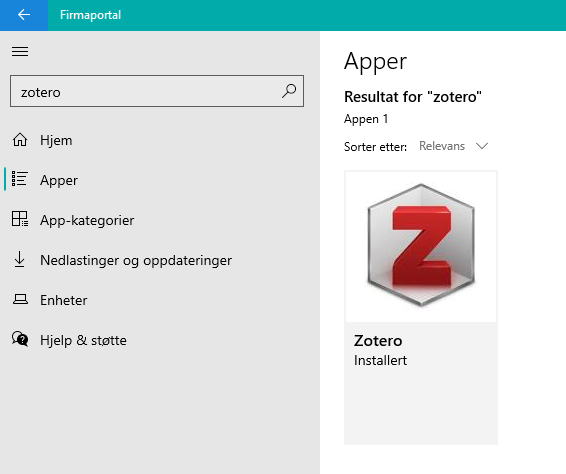
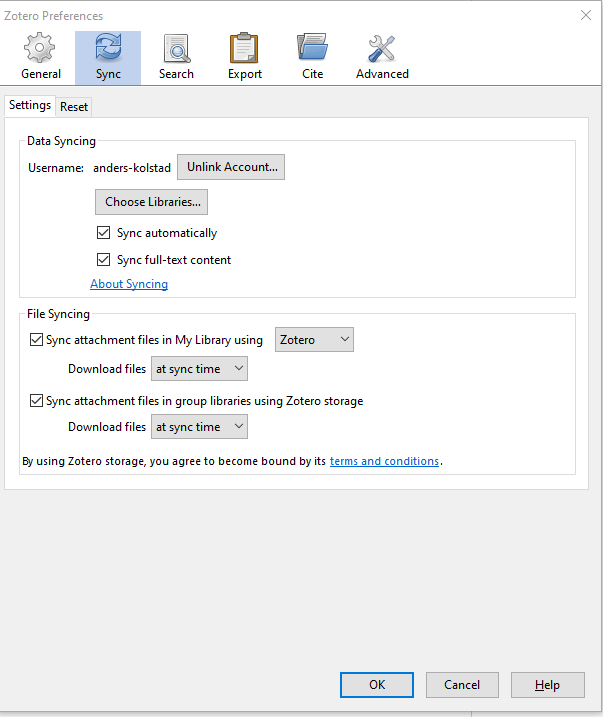
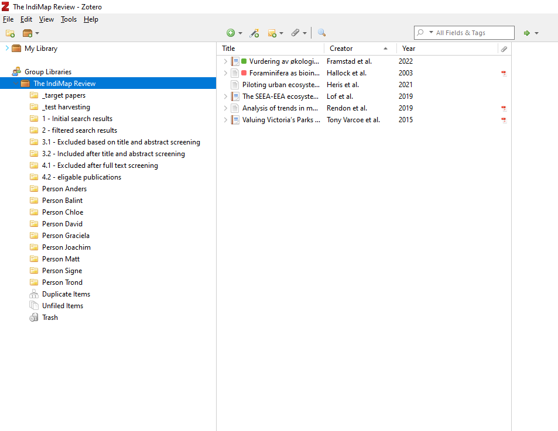
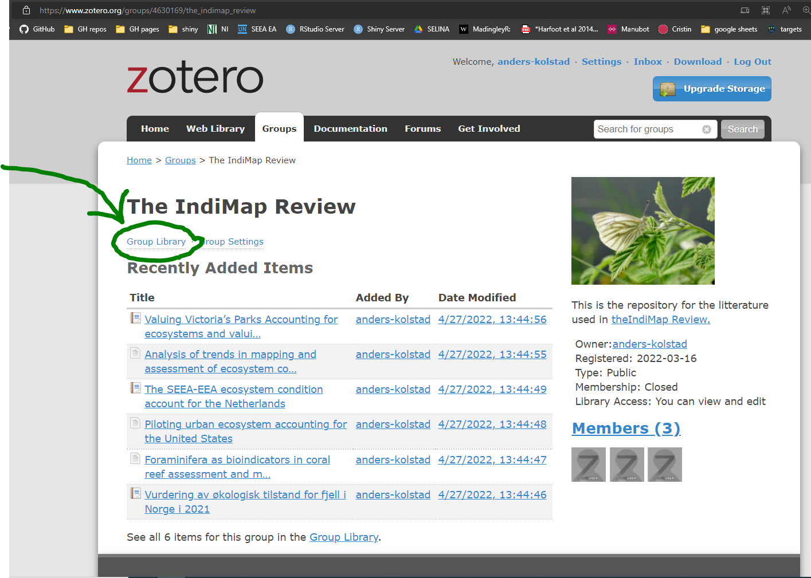
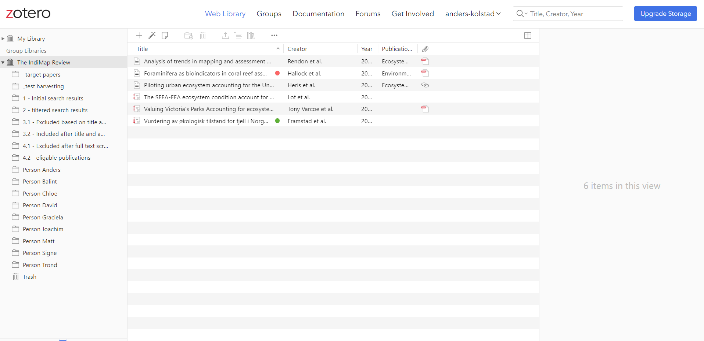
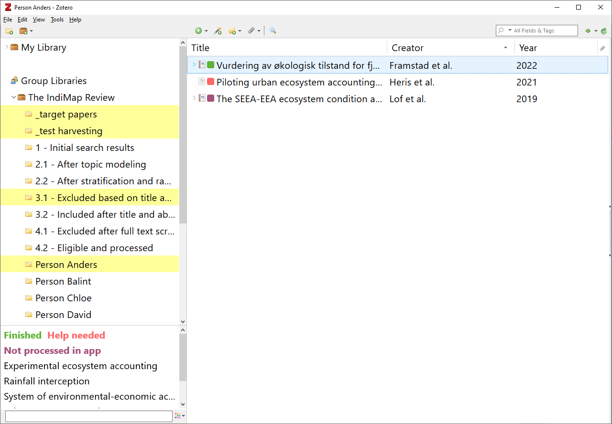

```{r setup, include=FALSE}
knitr::opts_chunk$set(echo = TRUE)
```


# Getting started
This is an instruction for how to use the Zotero reference manager in the reviewing process for the IndiMap review. 

Zotero exists both as a [website](https://www.zotero.org/) and as a desktop app (available via Firmaportal at NINA):

{width=50%}

Go online, create an account. When you have your user name, email it to Anders (alternatively to Matt) and he will add you to the group. 

Next, download the desktop app and sign inn there. Go to `Edit -> Preferences -> Sync` and and set up automatic syncing to the online account:

{width=50%}

Alternatively, you can right-click the main folder and press _sync_.
When you now open your desktop app, it should be synced with the onilne library, and hopefully look a little bit like this:

{width=90%}


The [zotero group](https://www.zotero.org/groups/4630169/the_indimap_review) is readable by anyone (part of documenting our work), but only members can edit. When viewing the groups home page, click *Group library*:

{width=90%}

That will take you to this screen:

{width=90%}

which looks similar, and has a lot of the same functionality, as the desktop app.
Note that these instructions were written before the references were added. Therefore the screen will look a little different.


# Workflow and folder structure
In the shared library there are several folders. These folders are linked, so that copying a reference from the main folder to the other folders will not create duplicates. The entries will simply link to the same reference object, and one reference can be in multiple folders.

All the references from the systematic search will be added to the folder `1 - initial search results`. The references that pass the topic modeling stage will be copied over to the `2.1 - After topic modeling` folder. From these we will make a stratified section of the most recent references and maybe also of actual ecosystem assessments, and put these under `2.2 - After stratification and random selection` folder. Also in that folder is a random sample of other references. This step is necessary in order to reduce the workload.

For the references in folder `2.2` we (Anders and Matt) will find the full text and add the url or doi to the reference object. After this, the references will delegated to the review team by coping references from folder `2.2` to the folders starting with `Person xxx`. 

Each person in the review team will then have his or her own folder to work through. Click on the reference to open the url and go to the full text. Read the title and abstract and decide whether the reference passes the inclusion criteria. Then right click on the reference in your folder and chose to `add to collection` and copy the reference to the appropriate folder, either `3.1 - Excluded based on title and abstract screening` or `3.2 - Included after title and reference screening`. If it passed, and you copied it to folder `3.2`, then you can go on to read the full text, or as much of it as you need in order to judge the inclusion criteria or to record the required data fields. If when reading, you find that the reference is not eligible, then copy it to folder `4.1 - Excluded after full text screening`.  If not, when you have recorded all the data fields and created one csv file for the reference, and one csv file for each the indicators it contains, using the data entry app, then copy the reference to folder `4.2 - Eligible and processed`.


# Practical tips
## Data entry app
The [data entry app](https://view.nina.no/IndiMap/) is an online shiny app that allows you to record the required data field for each reference and each indicator in a standardized way. See the app itself for instructions for use. A little tip though, is to keep a list of the required field in front of you when reading and take note about how you want to score it. That way, you can type your answer into th app rapidly in one go at the end. The shiny app may go to sleep if kept idle, and you could lose your work!


## Find folders 
In zotero, if you select a reference and hold `Ctrl`, you will see all the folders where that reference is found, highlighted. In the example from the screen shot below, the reference Framstad et al 2022 is found in Anders' folder, and three others, incl. folder 3.1:

{width=90%}

## Tags
In the example above, you can also see that the three references there are tagged with either green (= finished), red (= Help needed) or purple (= not processed in app). You can assigne either of these tags to a reference by clicking the reference and then the number 1, 2 or 3, respectively. Turn the off in the same way. Then, to subset you personal folder to only show refs with a certain tag, click that tag in the lower left side of the screen (see screen shot above). Tags are only used for your own personal organisation of your folder, and do not mean anything for the review as such. 

## Trading papers
Feel free to trade references with each other so that you ghet to read things that interests you. Connact the person before hand to arrange the trade. Follow up by simply adding the reference to you colleges collection and deleting it from your own. Do not duplicate the reference - make sure when finished that the reference only exist in one personal folder.


